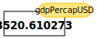

## Variables

Any Python interpreter can be used as a calculator:
~~~
3 + 5 * 4
~~~
{: .language-python}
~~~
23
~~~
{: .output}

This is great but not very interesting.
To do anything useful with data, we need to assign its value to a _variable_.
In Python, we can [assign]({{ page.root }}/reference.html#assign) a value to a
[variable]({{ page.root }}/reference.html#variable), using the equals sign `=`.
For example we can capture the gross domestic power per capita for a country by 
assinging the value ? to a variable gdpPercapUSD:

~~~
gdpPercapUSD = 2449
~~~
{: .language-python}

From now on, whenever we use `gdpPercapUSD`, Python will substitute the value we assigned to
it. In layman's terms, **a variable is a name for a value**.

In Python, variable names:

 - can include letters, digits, and underscores
 - cannot start with a digit
 - are [case sensitive]({{ page.root }}/reference.html#case-sensitive).

This means that, for example:
 - `gdpPercap0` is a valid variable name, whereas `0gdpPercap` is not
 - `gdp_percap` and `GDP_percap` are different variables

## Types of data
Python knows various types of data. Three common ones are:

* integer numbers
* floating point numbers, and
* strings.

In the example above, variable `gdpPercapUSD` has an integer value of `2449`.
If we want to capture the gdp per capita of the country more precisely
we can use a floating point value by executing:

~~~
gdpPercapUSD = 2449.008185
~~~
{: .language-python}

To create a string, we add single or double quotes around some text.
To keep track of the year we are working with we can store the year
in a string:

~~~
year = "1952"
~~~
{: .language-python}

## Using Variables in Python

Once we have data stored with variable names, we can make use of it in calculations.
We may want to store the country's gdp percapita in US dollars and in British pounds:

~~~
gdpPercapGBP = gdpPercapUSD * 0.779063
~~~
{: .language-python}

We could add the year to the label `gdpPercap_`

~~~
columnlabel = 'gdpPercap_' + year
~~~
{: .language-python}

## Built-in Python functions

To carry out common tasks with data and variables in Python,
the language provides us with several built-in [functions]({{ page.root }}/reference.html#function).
To display information to the screen, we use the `print` function:

~~~
print(gdpPercapUSD)
print(gdpPercapGBP)
print(columnlabel)
~~~
{: .language-python}

~~~
2249.008185
1752.119063630655
gdpPercap_1952
~~~
{: .output}

When we want to make use of a function, referred to as calling the function,
we follow its name by parentheses. The parentheses are important:
if you leave them off, the function doesn't actually run!
Sometimes you will include values or variables inside the parentheses for the function to use.
In the case of `print`,
we use the parentheses to tell the function what value we want to display.
We will learn more about how functions work and how to create our own in later episodes.

We can display multiple things at once using only one `print` call:

~~~
print(columnlabel , 'for Algeria:' , gdpPercapUSD , '(USD)')
~~~
{: .language-python}
~~~
gdpPercap_1952 for Algeria: 2249.008185 (USD)
~~~
{: .output}

We can also call a function inside of another
[function call]({{ page.root }}/reference.html#function-call).
For example, Python has a built-in function called `type` that tells you a value's data type:

~~~
print(type(2249.008185))
print(type(columnlabel))
~~~
{: .language-python}

~~~
<class 'float'>
<class 'str'>
~~~
{: .output}

Moreover, we can do arithmetic with variables right inside the `print` function:

~~~
print('gdpPercap in GBP:', gdpPercapUSD * 0.779063)
~~~
{: .language-python}

~~~
gdpPercap in GBP: 1752.119063630655
~~~
{: .output}

The above command, however, did not change the value of `gdpPercapUSD`:
~~~
print(gdpPercapUSD)
~~~
{: .language-python}

~~~
2249.008185
~~~
{: .output}

To change the value of the `gdpPercapUSD` variable, we have to
**assign** `gdpPercapUSD` a new value using the equals `=` sign:

~~~
gdpPercapUSD = 3520.610273	
print('The gdp per capita for Angola in USD is:', gdpPercapUSD)
~~~
{: .language-python}

~~~
The gdp per capita for Angola in USD is: 3520.610273
~~~
{: .output}

> ## Variables as Sticky Notes
>
> A variable in Python is analogous to a sticky note with a name written on it:
> assigning a value to a variable is like putting that sticky note on a particular value.
>
> 
>
> Using this analogy, we can investigate how assigning a value to one variable
> does **not** change values of other, seemingly related, variables.  For
> example, let's store the, country Angola's, gdp per capita GPB in its own variable:
>
> ~~~
> # gdp per capita for Angola
> gdpPercapGBP = gdpPercapUSD * 0.779090
> print('gdp per capita in GBP', gdpPercapGBP, 'and in USD:', gdpPercapUSD)
> ~~~
> {: .language-python}
>
> ~~~
> gdp per capita in GBP 2742.8722575915695 and in USD: 3520.610273
> ~~~
> {: .output}
>
> 
>
> Similar to above, the expression `gdpPercapUSD * 0.779090` is evaluated to `2742.8722575915695`,
> and then this value is assigned to the variable `gdpPercapGBP` (i.e. the sticky
> note `gdpPercapGBP` is placed on `2742.8722575915695`). At this point, each variable is
> "stuck" to completely distinct and unrelated values.
>
> Let's now change `gdpPercapUSD`:
>
> ~~~
> gdpPercapUSD = 851.241141
> print('gdp percapita in USD is now:', gdpPercapUSD, 'and gdp per capita in GBP is still: ', gdpPercapGBP)
> ~~~
> {: .language-python}
>
> ~~~
> gdp percapita in USD is now: 851.241141 and gdp per capita in GBP is still:  2742.8722575915695
> ~~~
> {: .output}
>
> 
>
> Since `gdpPercapGBP` doesn't "remember" where its value comes from,
> it is not updated when we change `gdpPercapUSD`.
{: .callout}

> ## Check Your Understanding
>
> What values do the variables `mass` and `age` have after each of the following statements?
> Test your answer by executing the lines.
>
> ~~~
> mass = 47.5
> age = 122
> mass = mass * 2.0
> age = age - 20
> ~~~
> {: .language-python}
>
> > ## Solution
> > ~~~
> > `mass` holds a value of 47.5, `age` does not exist
> > `mass` still holds a value of 47.5, `age` holds a value of 122
> > `mass` now has a value of 95.0, `age`'s value is still 122
> > `mass` still has a value of 95.0, `age` now holds 102
> > ~~~
> > {: .output}
> {: .solution}
{: .challenge}

> ## Sorting Out References
>
> Python allows you to assign multiple values to multiple variables in one line by separating
> the variables and values with commas. What does the following program print out?
>
> ~~~
> first, second = 'Grace', 'Hopper'
> third, fourth = second, first
> print(third, fourth)
> ~~~
> {: .language-python}
>
> > ## Solution
> > ~~~
> > Hopper Grace
> > ~~~
> > {: .output}
> {: .solution}
{: .challenge}

> ## Seeing Data Types
>
> What are the data types of the following variables?
>
> ~~~
> planet = 'Earth'
> apples = 5
> distance = 10.5
> ~~~
> {: .language-python}
>
> > ## Solution
> > ~~~
> > type(planet)
> > type(apples)
> > type(distance)
> > ~~~
> > {: .language-python}
> >
> > ~~~
> > <class 'str'>
> > <class 'int'>
> > <class 'float'>
> > ~~~
> > {: .output}
> {: .solution}
{: .challenge}


